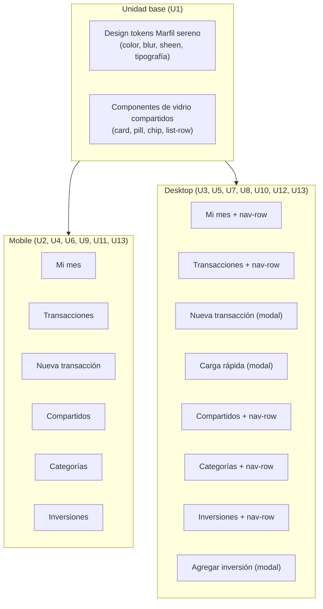

# feat: Rediseño visual "Marfil sereno" — implementación completa mobile + desktop

**Target repo:** finanzas (repo real del proyecto — este documento se escribió fuera de él; ver nota en Contexto y Limitaciones)

---

## Summary

Migrar toda la app de finanzas del estilo visual actual al nuevo sistema "Marfil sereno" (claro, acento verde pino, superficies de vidrio con blur/sheen), validado a través de mockups estáticos en Claude Artifacts sobre 6 pantallas y sus variantes mobile + desktop. El reemplazo es directo (sin feature flag) y se ejecuta como una sola ronda de trabajo con Fable, sin fases intermedias.

---

## Contexto y limitaciones

Este plan se escribió en una sesión que **no tiene acceso al repo real de finanzas** (no es un directorio git). Por eso:

- No hay investigación de código existente (patrones, componentes, convenciones) — las Implementation Units abajo describen el resultado visual/funcional esperado, no la implementación exacta contra archivos reales.
- Los `**Files:**` de cada unidad quedan como `TBD` — Fable debe mapearlos a los componentes/pantallas reales del repo al arrancar cada unidad.
- La fuente de verdad de diseño son los 12 artifacts publicados (listados en Sources & Research), no código.
- Antes de arrancar, Fable debería correr un mapeo rápido: para cada pantalla, ubicar el/los componentes React (u otro framework) que la renderizan hoy.

---

## Problem Frame

La app tiene un estilo visual anterior que ya no se usa como dirección final. Se corrieron mockups estáticos (sin datos reales) para validar "Marfil sereno" contra la alternativa "Vidrio frío" — Marfil sereno ganó. Se diseñaron variantes mobile y desktop de las pantallas principales, incorporando ajustes de contenido reales del producto (cuotas activas, $/día disponible, filtro por categoría, distinción de moneda ARS/USD, reembolsos en Compartidos, plazos fijos en Inversiones). El siguiente paso es llevar ese diseño al código real de la app.

---

## Requirements

- **R1.** Todas las pantallas de la app (mobile y desktop) deben adoptar la paleta y los componentes de "Marfil sereno": fondo `#F6F4EF`/`#EDEAE3`, acento verde pino `#33544A`, superficies de vidrio (`blur(24px)`, bordes sutiles, sheen animado), tipografía Avenir Next + serif itálica en acentos.
- **R2.** El reemplazo es directo — no convive con el estilo anterior detrás de un flag.
- **R3.** El contenido y comportamiento de cada pantalla debe igualar lo validado en los mockups (ver detalle por unidad más abajo), no solo el estilo.
- **R4.** Las transacciones deben distinguir moneda con el prefijo del monto (`$` ARS vs `US$` USD), sin elementos adicionales en la fila.
- **R5.** Desktop reemplaza cualquier sidebar de navegación por una fila de accesos (Nueva + los otros 4 destinos, excluyendo la página activa) debajo del título de cada pantalla — sin duplicar destinos en dos lugares distintos de la misma pantalla.
- **R6.** Los modales de desktop (Nueva transacción, Carga rápida, Agregar inversión) se centran sobre la pantalla de fondo atenuada/blureada, sin navegar a una URL nueva.

---

## Key Technical Decisions

- **KTD1 — Reemplazo directo sin flag.** Decisión del usuario: no hay periodo de convivencia con el estilo viejo. *Rationale:* coherente con cómo se ejecutaron rondas anteriores con Fable en este proyecto (ver memoria del proyecto: 4 rondas previas sin flags de convivencia).
- **KTD2 — Una sola ronda de ejecución.** Las 12 combinaciones pantalla×plataforma se implementan juntas, no en fases secuenciales. *Riesgo:* PR grande, difícil de revisar en partes — mitigado abajo en Risks.
- **KTD3 — Diseño como fuente de verdad, no código de referencia.** Los artifacts HTML no son código a copiar literalmente (usan un boilerplate de iframe de Claude Artifacts) — son especificación visual y de contenido. Fable debe reimplementar contra los componentes reales del stack de finanzas.
- **KTD4 — Nav-row de desktop es dinámico por página.** El botón correspondiente a la página activa se reemplaza por "Mi mes" (o se omite si ya se está en Mi mes), para no duplicar el destino actual — ver R5.

---

## High-Level Technical Design

---

## Implementation Units

### U1. Design tokens y componentes de vidrio compartidos

**Goal:** Establecer la base visual reusable (tokens de color, superficie de vidrio, sheen, tipografía) que todas las demás unidades consumen, para no reimplementar el mismo CSS/estilos en cada pantalla.

**Requirements:** R1

**Dependencies:** ninguna (unidad base)

**Files:** TBD — mapear al sistema de tokens/theme actual de finanzas (ej. `theme.ts`, `tailwind.config`, design-tokens.css, o equivalente del stack real)

**Approach:**
- Colores: `--bg:#F6F4EF`, `--accent:#33544A`, `--accent-tint:rgba(51,84,74,.10)`, `--neg:#A6452E`, `--ink:#20241F`, `--ink-dim:#63695D`, `--ink-faint:#9A9E8F`, `--line:rgba(32,36,31,.09–.10)`.
- Superficie de vidrio: `background: rgba(255,255,255,.62)`, `border:1px solid var(--line)`, `backdrop-filter: blur(24px)`, sombra interna sutil (`inset 0 1px 0 rgba(255,255,255,.85)`).
- Sheen: gradiente diagonal animado sobre superficies clave (headers principalmente) — considerar `prefers-reduced-motion`.
- Tipografía: sans (Avenir Next/system) para texto general, serif itálica (`ui-serif,'New York',Georgia`) para títulos y acentos destacados.
- Componentes base: card de vidrio, pill/chip, badge circular, barra de progreso fina.

**Test scenarios:**
- Test expectation: none — unidad de fundación visual (tokens/estilos), sin lógica de negocio.

**Verification:** Un componente de prueba renderiza correctamente en claro con blur visible, sheen respeta `prefers-reduced-motion`, tokens aplicados consistentemente en al menos 2 pantallas migradas.

---

### U2. Mi mes — mobile

**Goal:** Implementar la pantalla "Mi mes" en mobile según el mockup final.

**Requirements:** R1, R3

**Dependencies:** U1

**Files:** TBD — componente de pantalla principal/dashboard mobile actual

**Approach:** Header con avatar + selector de mes, saldo grande, sub del saldo con `$/día disponible · N días más a este ritmo`, pills de ingresos/gastos, 4 accesos rápidos (Nueva, Transacciones, Compartir, Categorías), card "Cuotas del mes" expandible mostrando 2-3 cuotas activas (descripción + tarjeta, "cuota X de Y", barra de progreso, monto), card de meta de ahorro, lista de categorías (top 4) con barra de progreso por categoría.

**Test scenarios:**
- Happy path: con datos de ejemplo, el saldo, `$/día` y pills renderizan con los valores esperados.
- Happy path: la card de cuotas expandida muestra cada cuota con su barra de progreso proporcional al avance.
- Edge case: sin cuotas activas, la card no rompe layout (estado vacío a definir con Fable).
- Edge case: categoría al 100% de uso muestra el color de alerta (`--neg`) en la barra.

**Verification:** Captura visual coincide con el mockup (https://claude.ai/code/artifact/53ffde9f-bbbf-4283-91be-0faf6b3161d3); valores dinámicos reemplazan los de ejemplo sin romper el layout.

---

### U3. Mi mes — desktop

**Goal:** Implementar "Mi mes" en desktop: barra superior fina, nav-row, layout de 2 columnas.

**Requirements:** R1, R3, R5

**Dependencies:** U1, U2 (mismo contenido, layout distinto)

**Files:** TBD — componente de dashboard desktop / layout de la app desktop

**Approach:** Barra superior con logo + avatar. Título "Mi mes" + selector de mes. Debajo, fila de navegación de 5 accesos (Nueva, Transacciones, Compartir, Categorías, Inversiones — sin repetir "Mi mes" porque es la página activa). Contenido en 2 columnas: izquierda (saldo + accesos rápidos + todas las categorías), derecha (Compartidos con Ama, Meta de ahorro, Cuotas activas, Presupuesto restante — en ese orden).

**Execution note:** Mayormente reestructuración de layout sobre el mismo contenido de U2; priorizar smoke/visual verification sobre unit tests nuevos.

**Test scenarios:**
- Happy path: nav-row no incluye "Mi mes" como botón mientras se está en esa página.
- Happy path: columna lateral respeta el orden Compartidos → Meta → Cuotas → Presupuesto restante.
- Integration: al navegar a otra página desde el nav-row, esa página muestra "Mi mes" en su lugar (ver U5).

**Verification:** Coincide con https://claude.ai/code/artifact/a9d49f71-5ade-4077-9168-694dba32a9db; nav-row nunca duplica la página activa en ninguna pantalla desktop.

---

### U4. Transacciones — mobile

**Goal:** Implementar la lista de transacciones en mobile con filtros y distinción de moneda.

**Requirements:** R1, R3, R4

**Dependencies:** U1

**Files:** TBD — componente de listado de transacciones mobile

**Approach:** Búsqueda + chips de filtro (Mes, Tipo, Fuente, Responsabilidad, Categoría), card de subtotal del período (neto, movimientos, ingresos, gastos), lista de filas con badge G/I, categoría+descripción, fecha, chip de responsabilidad, monto con prefijo `$`/`US$` según moneda.

**Test scenarios:**
- Happy path: una transacción en USD muestra el monto con prefijo `US$` en vez de `$`.
- Happy path: aplicar el chip "Categoría" filtra la lista visible.
- Edge case: lista vacía tras filtrar (estado vacío a definir con Fable).
- Integration: cambiar el filtro de mes actualiza el subtotal y la lista en conjunto.

**Verification:** Coincide con https://claude.ai/code/artifact/9e9a573c-ca66-4a55-ac63-2acd821c472c.

---

### U5. Transacciones — desktop

**Goal:** Versión desktop de Transacciones: lista + resumen lateral.

**Requirements:** R1, R3, R4, R5

**Dependencies:** U1, U3, U4

**Files:** TBD

**Approach:** Nav-row con "Mi mes" en vez de "Transacciones" (página activa). Columna principal: búsqueda + 5 chips de filtro + lista de movimientos. Columna lateral: card de resumen del período (neto, movimientos, ingresos, gastos).

**Test scenarios:**
- Happy path: transacción en USD con prefijo `US$`, igual que mobile.
- Integration: nav-row muestra "Mi mes", no "Transacciones", estando en esta página.

**Verification:** Coincide con https://claude.ai/code/artifact/1db03258-3af8-42c6-a80f-03804573efe8.

---

### U6. Nueva transacción — mobile

**Goal:** Formulario de carga de transacción en mobile.

**Requirements:** R1, R3

**Dependencies:** U1

**Files:** TBD — modal/pantalla de alta de transacción mobile

**Approach:** Toggle Gasto/Ingreso, acceso a "Carga múltiple" (ver U8), campos: Fecha, Categoría, Monto (con toggle ARS/USD), Fuente de pago, Mes de liquidación, Forma de pago (único/cuotas) — con bloque de cuotas condicional (cantidad, monto por cuota editable, mes de liquidación de la 1ª cuota, checkbox CFT + % anual), Responsabilidad (3 opciones), Descripción opcional, hint de equivalencia en USD al MEP + reparto.

**Test scenarios:**
- Happy path: seleccionar "En cuotas" revela el bloque de cuotas; "Pago único" lo oculta.
- Happy path: tildar "Tiene interés (CFT)" revela el campo de porcentaje anual.
- Edge case: cambiar cantidad de cuotas recalcula "monto por cuota" y la leyenda `N × $X = $total`.
- Integration: elegir una fuente de pago que sea tarjeta de crédito mantiene visible "Mes de liquidación" (comportamiento ya esperado hoy en la app real).

**Verification:** Coincide con https://claude.ai/code/artifact/3ffe6871-d91f-4e25-b854-a9f33e03aaeb.

---

### U7. Nueva transacción — desktop (modal)

**Goal:** Modal centrado de Nueva transacción en desktop, con formulario en 2 columnas.

**Requirements:** R1, R3, R6

**Dependencies:** U1, U6

**Files:** TBD

**Approach:** Modal sobre "Mi mes" atenuada de fondo (blur + scrim). Orden de campos: toggle Gasto/Ingreso → Fecha/Categoría → Monto/Fuente de pago → Responsabilidad (ancho completo) → Mes de liquidación/Forma de pago → bloque de cuotas (ancho completo, condicional) → Descripción (ancho completo) → hint → acciones (Cancelar/Guardar).

**Test scenarios:**
- Happy path: mismo comportamiento condicional de cuotas/CFT que U6, en el layout de 2 columnas.
- Integration: cerrar el modal (X o Cancelar) vuelve a "Mi mes" sin perder su estado.

**Verification:** Coincide con https://claude.ai/code/artifact/b75872ff-ca68-450c-a3d6-95e701240cf6.

---

### U8. Carga rápida / Modo Ráfaga — desktop (modal)

**Goal:** Flujo de carga secuencial de varias transacciones sin cerrar el modal entre cada una.

**Requirements:** R1, R3, R6

**Dependencies:** U1, U7

**Files:** TBD

**Approach:** Modal con el formulario completo de Nueva transacción **menos** Forma de pago/cuotas (siempre pago único); si la fuente elegida es tarjeta de crédito, sigue mostrando "Mes de liquidación" igual que hoy. Botón "Agregar y cargar otra" guarda el registro, limpia el formulario y lo suma a una lista lateral de "Cargado en esta sesión" con total acumulado y cantidad de transacciones. Botón "Listo" cierra el modal.

**Test scenarios:**
- Happy path: "Agregar y cargar otra" suma un item a la lista lateral y limpia el formulario sin cerrar el modal.
- Happy path: el total acumulado en la lista lateral refleja la suma de los items agregados en la sesión.
- Integration: "Listo" persiste todas las transacciones cargadas en la sesión y cierra el modal.

**Verification:** Coincide con https://claude.ai/code/artifact/97fb83e9-82b4-4b2f-a09a-5fcfa16c4f19.

---

### U9. Compartidos — mobile

**Goal:** Pantalla de gastos compartidos en mobile, con reembolsos y detalle de pago por persona en cada categoría.

**Requirements:** R1, R3

**Dependencies:** U1

**Files:** TBD

**Approach:** Editor de reparto (% Daniel/Ama editable), balance del mes con avatares superpuestos + CTA "Registrar pago", contribución del mes (barras de fairness por persona + total compartido), sección **Reembolsos** (pagos puntuales que uno adelantó — descripción, quién le debe a quién, monto), sección "Por categoría" con `Daniel $X · Ama $Y` y el neto a la derecha (mitad de lo que pagó el otro).

**Test scenarios:**
- Happy path: editar el reparto (ej. 60/40) y guardar actualiza el cálculo de contribución.
- Happy path: cada fila de categoría muestra correctamente cuánto pagó cada persona y el neto resultante.
- Edge case: reembolso ya saldado (fuera de scope de este mockup — confirmar con Fable si hace falta un estado "pagado").
- Integration: "Registrar pago" debería resolver o reducir el balance del mes (comportamiento a confirmar contra backend real).

**Verification:** Coincide con https://claude.ai/code/artifact/1fd5c37b-f138-4c66-992d-da95affd4307.

---

### U10. Compartidos — desktop

**Goal:** Versión desktop de Compartidos con reparto/balance/contribución arriba y categoría/reembolsos abajo en 2 columnas.

**Requirements:** R1, R3, R5

**Dependencies:** U1, U3, U9

**Files:** TBD

**Approach:** Nav-row con "Mi mes" en vez de "Compartir". Fila superior de 3 cards (Reparto, Balance del mes, Contribución del mes) a ancho completo. Debajo, 2 columnas: "Por categoría" (izquierda) y "Reembolsos" (derecha).

**Test scenarios:**
- Igual a U9, en el layout reorganizado.

**Verification:** Coincide con https://claude.ai/code/artifact/224c630c-07c0-4364-aa18-45e8a5554181.

---

### U11. Categorías — mobile

**Goal:** Gestión de categorías, fuentes de pago, tarjetas, y configuración de cuenta/pareja.

**Requirements:** R1, R3

**Dependencies:** U1

**Files:** TBD

**Approach:** 4 grupos apilados (Categorías de gasto, de ingreso, Fuentes/medios de pago, Tarjetas de crédito con badge "TC"), cada uno con fila de "agregar" (input + botón circular +) y acciones editar/eliminar por ítem. Sección "Cuenta y seguridad" (checkbox de conversión USD→ARS al MEP). Card de "Mi pareja" (workspace compartido).

**Test scenarios:**
- Happy path: agregar una categoría nueva la suma al final del grupo correspondiente.
- Happy path: eliminar una categoría la remueve de la lista (confirmar si requiere modal de confirmación — no estaba en el mockup, a definir con Fable).
- Edge case: grupo vacío (sin categorías) — estado a definir.

**Verification:** Coincide con https://claude.ai/code/artifact/0dd66b64-f485-4ddf-ad09-52a6cd358c1d.

---

### U12. Categorías — desktop

**Goal:** Versión desktop de Categorías: grid 2×2 + columna lateral.

**Requirements:** R1, R3, R5

**Dependencies:** U1, U3, U11

**Files:** TBD

**Approach:** Nav-row con "Mi mes" en vez de "Categorías". Los 4 grupos en grid de 2×2 a la izquierda; "Cuenta y seguridad" + "Mi pareja" en la columna derecha.

**Test scenarios:** Igual a U11, en el layout de grid.

**Verification:** Coincide con https://claude.ai/code/artifact/ab5390f2-0867-4e65-be22-ee881e2496d2.

---

### U13. Inversiones — mobile y desktop (con Plazos fijos y alta)

**Goal:** Pantalla de cartera de inversiones (Cripto, Acciones, Plazos fijos) y su flujo de alta.

**Requirements:** R1, R3, R6

**Dependencies:** U1, U3 (para nav-row en desktop), U7 (patrón de modal)

**Files:** TBD

**Approach:**
- **Mobile:** valor total de la cartera + variación + split simple (chips de % por tipo), secciones Cripto y Acciones con tenencias (cantidad, valor actual, variación). *Nota: el mockup mobile original no incluye aún Plazos fijos ni el botón de agregar — ver Open Questions.*
- **Desktop:** columna lateral con resumen (valor total, variación, split entre 3 categorías); a la derecha, Cripto, Acciones y Plazos fijos (monto, TNA, interés ganado a la fecha, vencimiento) lado a lado. Botón "Agregar inversión" en el topbar.
- **Modal "Agregar inversión" (desktop):** selector de tipo (Plazo fijo, Cripto, Acción). Para Plazo fijo: Monto, Banco/entidad, TNA, Plazo (días), Fecha de inicio, Vencimiento (calculado automáticamente a partir del plazo). Los campos de Cripto/Acción quedan por definir (no se diseñaron en el mockup — ver Open Questions).

**Test scenarios:**
- Happy path: split de la cartera (%) suma 100% entre las categorías presentes.
- Happy path: en el modal de agregar, cambiar "Plazo" recalcula automáticamente "Vencimiento" a partir de la fecha de inicio.
- Edge case: TNA con decimales (coma como separador, según convención de la app) se guarda y muestra correctamente.
- Integration: agregar un plazo fijo nuevo lo suma a la lista de "Plazos fijos" y actualiza el valor total + split de la cartera.

**Verification:** Coincide con:
- Inversiones mobile: https://claude.ai/code/artifact/3c328c04-d6b7-4c26-bd5d-972996cdf4f0
- Inversiones desktop: https://claude.ai/code/artifact/3595d551-a526-4af7-b3db-7123bcf50e73
- Agregar inversión (desktop): https://claude.ai/code/artifact/89a11e06-f2ad-429a-b516-dc0b5c912dd4

---

## Scope Boundaries

**In scope:** las 12 combinaciones pantalla×plataforma listadas en las Implementation Units, con el contenido y comportamiento validado en los mockups.

### Deferred to Follow-Up Work

- Diseño mobile del modal "Nueva transacción → Carga rápida" (solo se diseñó desktop).
- Diseño mobile del flujo "Agregar inversión" (solo se diseñó desktop) y campos específicos para Cripto/Acción en ese modal (solo Plazo fijo quedó completamente definido).
- Estados vacíos (categorías sin ítems, transacciones filtradas sin resultados, cartera sin inversiones) — no se diseñaron explícitamente en los mockups.
- Estado "reembolso ya pagado" en Compartidos (el mockup solo muestra pendientes).
- Accesibilidad y contraste WCAG sobre la paleta Marfil sereno — no auditado en esta ronda de diseño.

### Outside this product's identity

- No se evaluó ni se planea una convivencia prolongada con el estilo visual anterior (ver KTD1).

---

## Open Questions

- **¿Confirmación al eliminar categorías/fuentes/tarjetas?** Los mockups no muestran un modal de confirmación — definir con Fable si hace falta uno antes de borrar.
- **¿Qué pasa al filtrar transacciones sin resultados?** No hay estado vacío diseñado.
- **¿Los campos de "Agregar inversión" para Cripto y Acción?** Solo Plazo fijo se diseñó completo — Fable necesita definir esos campos (probablemente: ticker/activo, cantidad, precio de compra, fecha) antes de implementar esas dos ramas del selector de tipo.
- **¿"Registrar pago" en Compartidos liquida el balance del mes automáticamente o abre otro flujo?** No se diseñó esa pantalla/interacción.

---

## Sources & Research

Todos los mockups fueron construidos y validados en esta conversación, en Claude Artifacts, con datos de ejemplo (sin conexión a datos reales):

| Pantalla | Mobile | Desktop |
|---|---|---|
| Mi mes | https://claude.ai/code/artifact/53ffde9f-bbbf-4283-91be-0faf6b3161d3 | https://claude.ai/code/artifact/a9d49f71-5ade-4077-9168-694dba32a9db |
| Transacciones | https://claude.ai/code/artifact/9e9a573c-ca66-4a55-ac63-2acd821c472c | https://claude.ai/code/artifact/1db03258-3af8-42c6-a80f-03804573efe8 |
| Nueva transacción | https://claude.ai/code/artifact/3ffe6871-d91f-4e25-b854-a9f33e03aaeb | https://claude.ai/code/artifact/b75872ff-ca68-450c-a3d6-95e701240cf6 |
| Carga rápida | — (no diseñado) | https://claude.ai/code/artifact/97fb83e9-82b4-4b2f-a09a-5fcfa16c4f19 |
| Compartidos | https://claude.ai/code/artifact/1fd5c37b-f138-4c66-992d-da95affd4307 | https://claude.ai/code/artifact/224c630c-07c0-4364-aa18-45e8a5554181 |
| Categorías | https://claude.ai/code/artifact/0dd66b64-f485-4ddf-ad09-52a6cd358c1d | https://claude.ai/code/artifact/ab5390f2-0867-4e65-be22-ee881e2496d2 |
| Inversiones | https://claude.ai/code/artifact/3c328c04-d6b7-4c26-bd5d-972996cdf4f0 | https://claude.ai/code/artifact/3595d551-a526-4af7-b3db-7123bcf50e73 |
| Agregar inversión | — (no diseñado) | https://claude.ai/code/artifact/89a11e06-f2ad-429a-b516-dc0b5c912dd4 |

Contexto de proyecto adicional (memoria): 4 rondas previas con Fable sobre seguridad, ideación, UI y mobile (PR #37–#77); harness de tests del proyecto; preferencia por reemplazo directo sin flags en rondas anteriores.

---

## Definition of Done

- Las 12 pantallas (6 mobile + 6 desktop) migradas a Marfil sereno, verificadas visualmente contra su mockup correspondiente.
- Ningún resto visible del estilo visual anterior en las pantallas migradas.
- Nav-row de desktop nunca duplica la página activa (R5) en ninguna de las 6 pantallas desktop.
- Transacciones distinguen moneda con el prefijo `$`/`US$` en mobile y desktop.
- Open Questions resueltas o explícitamente pospuestas con el equipo antes de cerrar la ronda.
